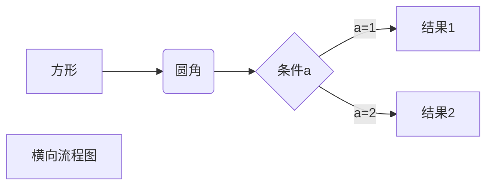
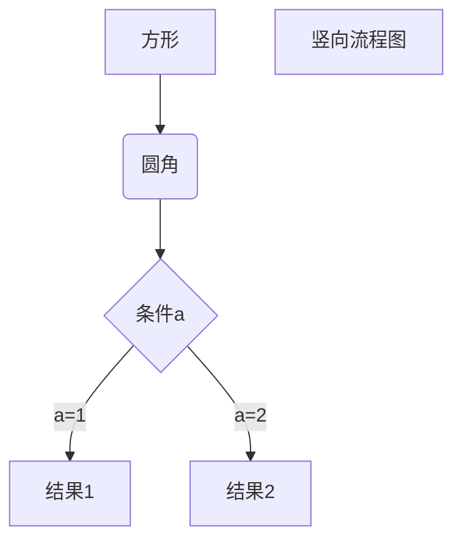
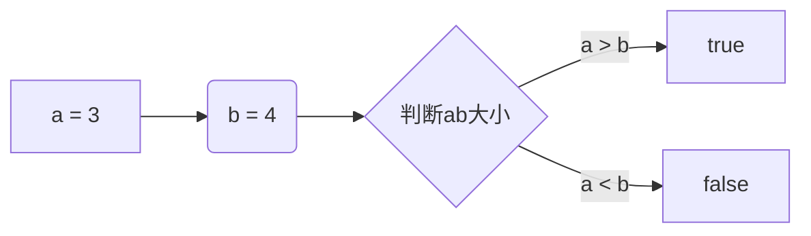

# HELLO WORLD

## HELLO WORLD

# 一级标题

## 二级标题

_斜体_

**粗体**

**_粗斜体_**

---

~~删除~~

<u>下划线</u>

创建脚注 [^test]。

[^test]: 123

创建脚注格式类似这样 [^1]

[^1]: 这里对 1 作说明

创建脚注格式类似这样 [^runoob]。

[^runoob]: 菜鸟教程 -- 学的不仅是技术，更是梦想！！！

无序列表

- 第一条
- 第二条
- 第三条

有序列表

1. 第一条
2. 第二条
3. 第三条

列表嵌套

1. 第一条
   - 1.1 小段
2. 第二条
   - 2.1 第二个小段
   - 2.2 第 2.2 个小段

> 区块引用
> 我的学习目标
> 略显迷茫

列表中使用区块

1. 第一条
   > 第一条的区块
2. 代码区块
   const test = true;
   console.log(test);

完事

```typescript
enum EItem {}
```

这里有一个链接，点击可以去[百度](http://www.baidu.com)

预览图片


#####表格

| 姓 名 | 年龄 | 性别 |
| :---- | ---: | :--: |
| zzp   |   18 |  男  |



  
  




